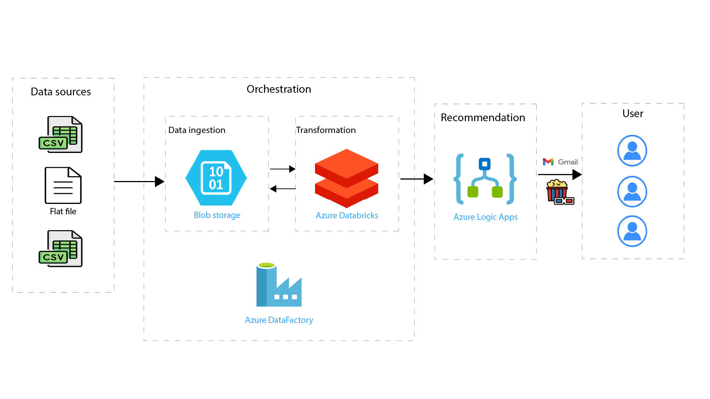

# Movie recommend data pipeline with Azure
This project provides a hands-on experience of building a complete data pipeline using Azure services and implementing a machine learning model for movie recommendations. It is an excellent opportunity for me to understand the practical aspects of data engineering and machine learning.

In this project, we will build a end-to-end data pipeline for a movie recommendation system using Azure services. The recommendation system is developed using collaborative filtering and PySpark ML, which is a machine learning library in Spark.

## Architecture diagram

## Overview
*   We will use the datasets from Movielens, which includes ratings and movie data up to 25M records.
*   The data will be stored in Azure Blob Storage, a scalable and secure data storage solution.
*   The data transformation process will be handled by Azure Databricks, a fast, easy, and collaborative Apache Spark-based analytics platform.
*   The data pipeline will be orchestrated in Azure DataFactory, a cloud-based data integration service.
*   Additional components like Azure Logic App, Azure Active Directory, and Key Vault will be used for automation, security, and identity management.
*   The model will be trained and tested on a large dataset, achieving a RMSE of 0.814 on the test set. The system will be capable of recommending the top 10 movies for a given user.

